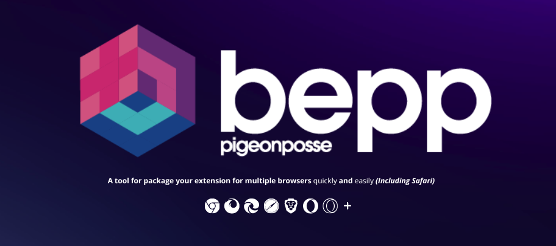
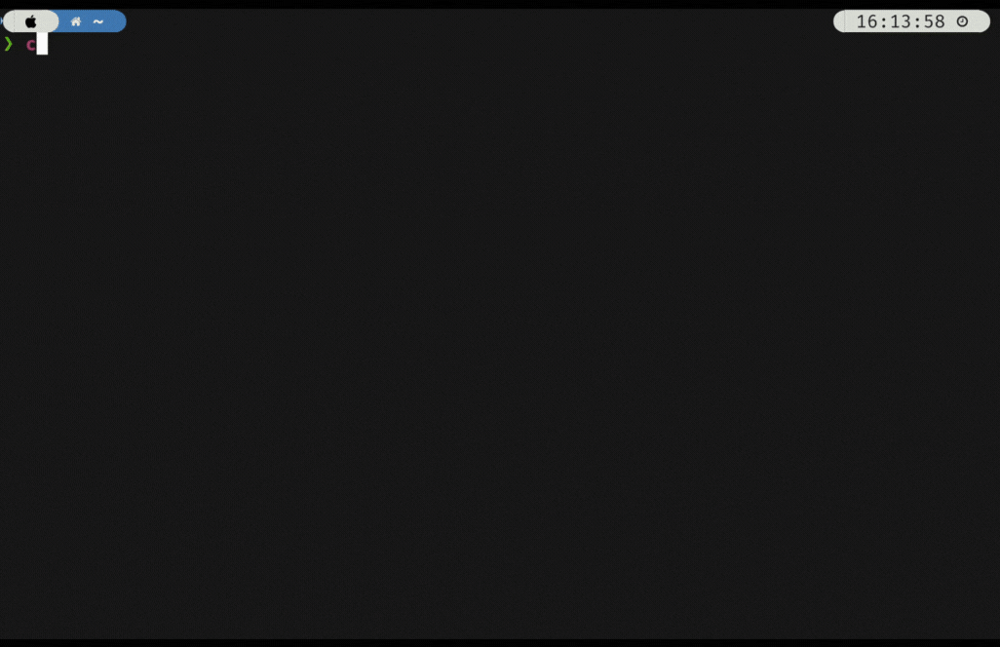

# BEPP - A Cross-Browser Extension Builder



A tool for package your extension for multiple browsers quickly and easily _(Including Safari)_

**Bepp** is a Cross-Browser Extension Builder, a tool for package your extension for multiple browsers quickly and easily.
This tool include support for browsers as Safari, Chrome, Firefox, Edge, Brave, etc.

- [Documentation](https://bepp.pigeonposse.com)
- [Installation](https://bepp.pigeonposse.com/guide/getting-started#installation)
- [Init](https://bepp.pigeonposse.com/guide/init)
- [Build multiple extensions](https://bepp.pigeonposse.com/guide/build)
- [Build extensions with config file](https://bepp.pigeonposse.com/guide/build/config-file)
- [Build Safari extension](https://bepp.pigeonposse.com/guide/build/safari)
- [GitHub action Documentation](https://bepp.pigeonposse.com/guide/gh-action)

## Installation _(CLI and Libary)_

```bash
npm install @bepp/bepp 
# or
pnpm i @bepp/bepp
# or
yarn add @bepp/bepp 
```

## Preview

**Bepp** is easy and fast 🚀🌈
> Build 13 types of extensions _(including Safari)_ in **21s**



## Github action

You can use bepp as a **GitHub action**.

- [Read more](https://bepp.pigeonposse.com/guide/gh-action)

## Example

```yaml
name: Build extensions
on:
  push:
    branches:
      - main
jobs:
  build:
    name: Build extensions with bepp
    runs-on: macos-latest # Must be macos for safari extension build
    steps:
      - name: 🛎 Checkout
        uses: actions/checkout@v4
      - name: Build
        uses: pigeonposse/bepp
        # For custom config file input
        # Default looks for file in workspace path bepp.config.json, bepp.config.yaml, bepp.config.toml
        # with:
        #   file: './custom-bepp.config.json'
  
```

- [Read more documentation](https://bepp.pigeonposse.com/guide/gh-action)

## 👨‍💻 Development

**BEPP** is an open-source project and its development is open to anyone who wants to participate.

[](https://bepp.pigeonposse.com/dev-getting-started)

## ☕ Donate

Help us to develop more interesting things.

[](https://pigeonposse.com/?popup=donate)

## 📜 License

This software is licensed with GPLv3 (GNU GENERAL PUBLIC LICENSE Version 3).

[](https://github.com/pigeonposse/bepp/blob/main/LICENSE)

## 🐦 About us

*PigeonPosse* is a ✨ **code development collective** ✨ focused on creating practical and interesting tools that help developers and users enjoy a more agile and comfortable experience. Our projects cover various programming sectors and we do not have a thematic limitation in terms of projects.

[](https://github.com/PigeonPosse/PigeonPosse)

### Collaborators

|                                                                                    | Name         | Role         | Contribution | GitHub                                         |
| ---------------------------------------------------------------------------------- | ------------ | ------------ | ------------ | ---------------------------------------------- |
|  | Ángel Espejo | Author       | Idea & Development | [@AngelEspejo](https://github.com/AngelEspejo) |
|  | Alejo Malia  | Developer       | Logo & banner design | [@AlejoMalia](https://github.com/AlejoMalia) |
|  | PigeonPosse  | Collective   | Distribution | [@PigeonPosse](https://github.com/PigeonPosse) |

<br>
